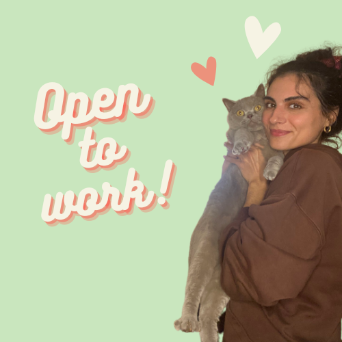
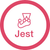

<h2 align="center">Hi there 👋 I'm Camilla, forensic scientist turned software developer.</h2>

I'm on a mission to inspire others to join the coding community and discover the endless possibilities of this amazing field.

After working as a science teacher, I decided to switch careers and pursue my love of coding. I completed a coding bootcamp which allowed me to  work on sevearl project and develop my skills as a full-stack developer. I'm currently interested in expanding my knowledge by learning React Native and practicing algorithms.

I also run a coding Instagram account where I share my journey and inspire others to make the switch. Come say hi and let's connect over our shared love of coding!

I'm always on the lookout for new opportunities and challenges, so if you have a cool project in mind or just want to chat, don't hesitate to reach out. Let's create something awesome together!

 

  
 
  
   
    
  
 

  
<h1 align="center">Languages and Tools</h1>

  
  
  
  
  
  
  
  
  
  
  
  
  
  
  
  

  

<h1 align="center">Projects</h1>

See the README.md of each project for more details about the specifics of the projects.

 

|               Project |                                                            |                                                          | Key Tech                 |
| --------------------: | ---------------------------------------------------------- | -------------------------------------------------------- | -------------------- |
| Circles - Community groups finder | [Github](https://github.com/sea-breezy/circles_app) | [Demo](https://circlesapp.netlify.app/) | Next, React, Tailwind CSS, Prisma, PostgreSQL, Cypress     |
|          Lumen - Resource library | [Github](https://github.com/sea-breezy/lumen-frontend-techtonic)        | [Demo](https://lumen.onrender.com/)         | React, PostgreSQL, Various Testing Libraries     |
|          Advent Calendar | [Github](https://github.com/sea-breezy/advent-calendar)        | [Demo](https://cas-adventcalendar.netlify.app/)         | React, CSS     |
|          Pomodoro Timer | [Github](https://github.com/sea-breezy/pomodoro-timer)        | [Demo](https://pomodoro-app1.netlify.app/)         | Next, Tailwind CSS     |

 

---

Footer
© 2023 GitHub, Inc.
Footer navigation
Terms
Privacy
Security
Status

